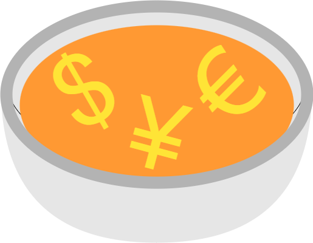

# Super Chat Currency Converter

    

This is a Chrome browser extension developed for YouTube live stream viewers who are interested in the actual amounts donated in Super Chats.

## Motivation

I was curious about how much people are spending in live stream chats, but with international audiences it becomes hard to get an accurate idea. That together with "how hard can it be to build a browser extension" brought me here.

## About the Icon

Some streaming communities started calling Super Chat messages "soup", so I took that and shaped noodles for currency symbols, and now here we are. Bon appétit!

## License

Built by haseHH in 2024, published under [GNU GPL v3](./LICENSE).
